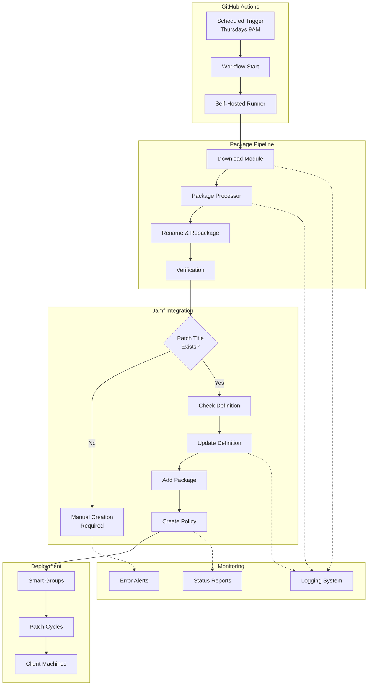

# 🗺️ Workflow Diagram & Architecture Map

## System Architecture Overview



## Data Flow

### 1. Trigger Phase
- **Input**: Cron schedule or manual trigger
- **Process**: GitHub Actions workflow initiation
- **Output**: Job execution on self-hosted runner

### 2. Download Phase
- **Input**: Application label (e.g., "1password")
- **Process**: 
  - Query vendor API/website
  - Download latest version
  - Cache with ETag/Last-Modified
- **Output**: Downloaded package file

### 3. Processing Phase
- **Input**: Raw package file (DMG/PKG/ZIP)
- **Process**:
  - Extract metadata (version, bundle ID)
  - Verify signature/Team ID
  - Rename per naming convention
  - Repackage if needed
- **Output**: Jamf-ready package

### 4. Jamf Upload Phase
- **Input**: Processed package
- **Process**:
  - Authenticate with Jamf API
  - Upload to distribution point
  - Create package record
- **Output**: Package ID in Jamf

### 5. Patch Management Phase
- **Input**: Package ID, version info
- **Process**:
  - Read/create patch title
  - Add/update definition
  - Link package to version
- **Output**: Configured patch definition

### 6. Policy Creation Phase
- **Input**: Patch definition, smart groups
- **Process**:
  - Create patch policies
  - Assign to patch cycles
  - Configure user interaction
- **Output**: Active patch policies

## Component Details

### Package Downloader
```python
PackageDownloader
├── get_latest_version()
├── download_package()
├── verify_checksum()
└── cache_management()
```

### Package Processor
```python
PackageProcessor
├── extract_metadata()
├── verify_signature()
├── rename_package()
└── repackage()
```

### Jamf Manager
```python
JamfPatchManager
├── authenticate()
├── upload_package()
├── manage_patch_title()
├── create_policy()
└── assign_smart_groups()
```

## Decision Points

1. **Package Changed?**
   - Yes → Continue processing
   - No → Skip (use cache)

2. **Patch Title Exists?**
   - Yes → Update definition
   - No → Alert for manual creation

3. **Definition Exists?**
   - Yes → Update version
   - No → Create new definition

4. **Policy Exists?**
   - Yes → Update policy
   - No → Create new policy

## API Endpoints Used

### Jamf Pro APIs
- `/api/v1/auth/token` - Authentication
- `/api/v2/patch-software-titles` - Patch titles
- `/api/v2/patch-policies` - Patch policies
- `/api/v1/packages` - Package management
- `/api/v1/computer-groups` - Smart groups

### Vendor APIs
- GitHub Releases API
- Vendor-specific download endpoints
- Update feed URLs (Sparkle, etc.)

## Security Boundaries
- GitHub Actions → Runner: GitHub token
- Runner → Jamf: API credentials
- Jamf → Clients: MDM trust
- Package verification: Team ID/signature